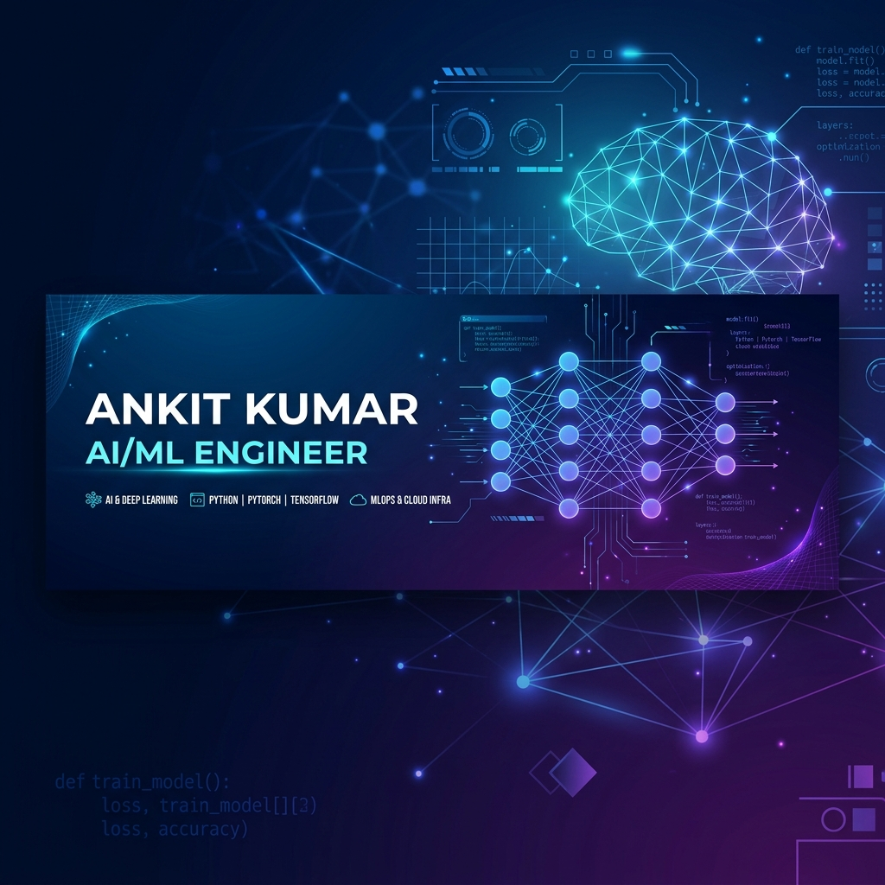

<div align="center">



[](https://git.io/typing-svg)

</div>

---

## 🧠 About Me

```python
class AnkitKumar:
    def __init__(self):
        self.role       = "AI/ML Engineer"
        self.education  = "B.Tech CS (AI/ML) @ Newton School of Technology"
        self.location   = "India 🇮🇳"
        self.focus      = ["Computer Vision", "LLMs & RAG", "Deep Learning"]
        self.stack      = ["Python", "TensorFlow", "LangChain", "OpenCV"]
        self.goal       = "Building production-grade AI that solves human problems 🚀"

    def current_status(self):
        return "Open to AI/ML Internship Opportunities!"
```

---

## 🚀 Featured Projects

<table border="0">
  <tr>
    <td width="50%" valign="top">
      <h3 align="center">🖐️ AI Gesture OS Control</h3>
      <p align="center">
        <a href="https://github.com/AkkiKrsingh2005/ai-gesture-os-control">
          
        </a>
      </p>
      <p>High-performance HCI system using <b>MediaPipe Tasks API</b>. Optimized for <b>Apple Silicon M3</b> with hardware acceleration for ultra-low latency cursor control.</p>
      <p align="center">
         
         
        
      </p>
    </td>
    <td width="50%" valign="top">
      <h3 align="center">📝 AI RAG Navigator</h3>
      <p align="center">
        <a href="https://github.com/AkkiKrsingh2005/ai-rag-navigator">
          
        </a>
        <a href="https://akkikrsingh2005-ai-rag-navigator-app-5gfm3y.streamlit.app/">
          
        </a>
      </p>
      <p>Enterprise-grade RAG app using <b>LangChain + Gemini 1.5 Flash + ChromaDB</b>. Features semantic chunking and history-aware retrieval for study materials.</p>
      <p align="center">
         
         
        
      </p>
    </td>
  </tr>
  <tr>
    <td width="50%" valign="top">
      <h3 align="center">🌿 Plant Health Vision</h3>
      <p align="center">
        <a href="https://github.com/AkkiKrsingh2005/plant-health-vision">
          
        </a>
        <a href="https://akkikrsingh2005-plant-health-vision-app-cuhriy.streamlit.app/">
          
        </a>
      </p>
      <p>AI-powered crop disease detection using <b>CNN (MobileNetV2)</b>. Identifies 20+ diseases with actionable care guides for smart agriculture.</p>
      <p align="center">
         
         
        
      </p>
    </td>
    <td width="50%" valign="top">
      <h3 align="center">💡 Future Forward</h3>
      <p align="center">🔨 Currently exploring <b>Agentic Workflows</b> & <b>Multi-Modal LLMs</b></p>
      <p align="center">
        <a href="https://github.com/AkkiKrsingh2005?tab=repositories">
          
        </a>
      </p>
    </td>
  </tr>
</table>

---

## 🛠️ Technical Arsenal

<div align="center">

| Category | Tools & Technologies |
| :--- | :--- |
| **Languages** | Python, SQL, C++, Java |
| **AI / ML** | TensorFlow, Scikit-learn, Pandas, NumPy, Keras |
| **CV & NLP** | OpenCV, MediaPipe, LangChain, HuggingFace |
| **Data & Cloud** | MongoDB, MySQL, ChromaDB, Streamlit, Git |

</div>

---

## 📊 GitHub Analytics

<div align="center">
  
  
</div>

<div align="center">
  
</div>

---

## 🤝 Let's Connect

<div align="center">

[](https://www.linkedin.com/in/ankit-kumar-821003327/)
[](https://portfolio-plum-nine-v2kb4jyv8c.vercel.app/)
[](https://github.com/AkkiKrsingh2005)

**Always open to innovative AI/ML projects and collaborations! 🚀**

</div>

---

<div align="center">

</div>
